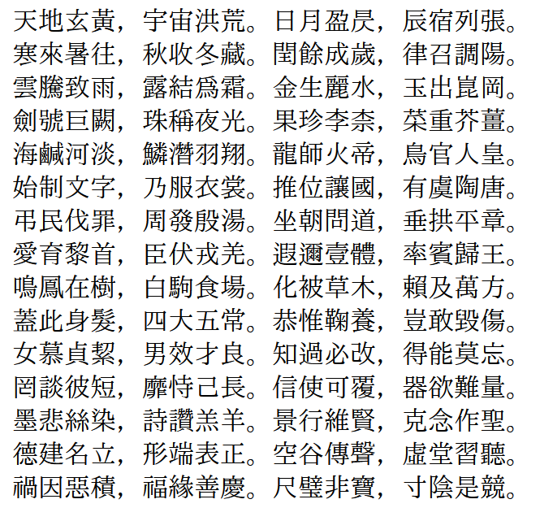
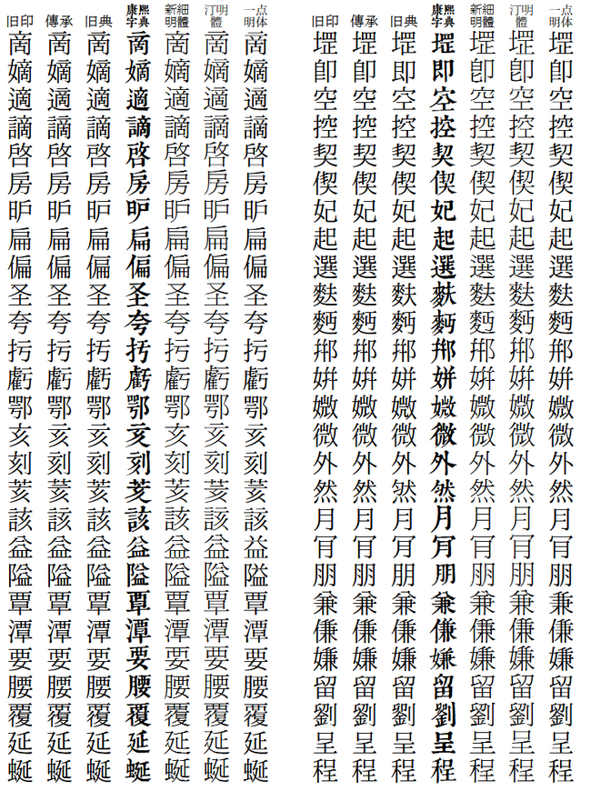
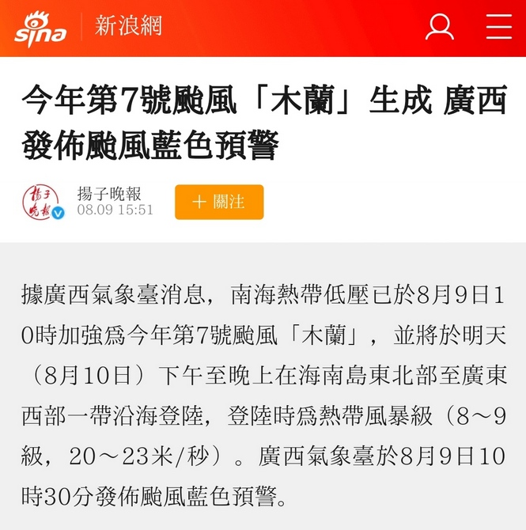

[繁體中文](../../#Huaying-Mincho-華英明朝-华英明朝) **简体中文**
# Huaying Mincho 华英明朝 華英明朝
**Huaying Mincho 华英明朝**是一套拥有传承字形、旧字形风格的中文字体。华英明朝共提供 3 种字形风格，并带有符合 [IVD_Charts_Moji_Joho](https://unicode.org/ivd/data/2017-12-12/IVD_Charts_Moji_Joho.pdf) 标准的异体选择器。
## 版本说明
#### 1. 华英明朝 旧印体
旧印刷体，字形接近*旧版 Windows 新细明体*。
#### 2. 华英明朝 传承体
传承字形版，综合参考了包括《康熙字典》在内的经典旧字形资料。
#### 3. 华英明朝 旧典体
接近《康熙字典》中的字形，并保留古籍中汉字部件变化不一的特点。
#### 4. 华英明朝 繁体
传承体基础上制作，简入繁出的字体。通过使用字体的 OpenType 技术，可根据文本的内容动态匹配一简多繁的情況。
## 详情及预览
* 传承体预览  
  
* 版本对比  
  
* 繁体版预览（文本为简体）  
  
* 简体字的制作  
本字体将简化字以“新字”对待，不使用简化字源头上的讹字、俗字、古字等字形。简体字部分在[霞鹜新致宋](https://github.com/lxgw/LxgwNeoZhiSong)基础上制作，制作中参考了简体对应的繁体字以及中国大陆早期（简繁过度时期）使用过的旧字形简化字。
* 可通过异体选择符输出 [IVD_Charts_Moji_Joho](https://unicode.org/ivd/data/2017-12-12/IVD_Charts_Moji_Joho.pdf) 中的字形。  

## 下载字体
1. 可从本站 [Releases](../../releases) 页面下载字体。
2. 可从[腾讯微云](https://share.weiyun.com/VEoOc5xK)下载 HuayingMincho 系列字体。
## 授权
华英明朝字体是基于 [IPAmj明朝](https://moji.or.jp/mojikiban/font/)的衍生字体，遵循 [IPA Font License Agreement v1.0](./LICENSE.txt) 协议。
## 鸣谢
* [IPAmj明朝](https://moji.or.jp/mojikiban/font/)
* [霞鹜新致宋](https://github.com/lxgw/LxgwNeoZhiSong)
* [FontForge](https://github.com/fontforge/fontforge)
* [AFDKO](https://github.com/adobe-type-tools/afdko/)
## 相关资料
* [IVD 2017-12-12 Moji_Joho](https://unicode.org/ivd/data/2017-12-12/IVD_Charts_Moji_Joho.pdf)
* [GlyphWiki](https://glyphwiki.org/)
## 关于作者
- **Email：** chunfengfly@outlook.com
