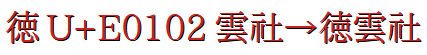

**繁體中文** [简体中文](README-SC.md#Huaying-Mincho-华英明朝)
# Huaying Mincho 華英明朝
**Huaying Mincho 華英明朝**是一套擁有傳承字形、舊字形風格的中文字型。華英明朝共提供 3 種字形風格，並帶有符合 [IVD_Charts_Moji_Joho](https://unicode.org/ivd/data/2017-12-12/IVD_Charts_Moji_Joho.pdf) 標準的異體選擇器。
## 版本說明
#### 1. 華英明朝 舊印體
舊印刷體，字形接近*新細明體（舊版）*。
#### 2. 華英明朝 傳承體
傳承字形，字形部件較為統一。
#### 3. 華英明朝 舊典體
接近《康熙字典》中的字形，字形部件不統一。
#### 4. 華英明朝 繁體
由傳承體修改，可實現簡入繁出的字型。
## 預覽
* 傳承體預覽  
  
* 版本對比  
  
* 繁體版預覽（文字為簡體）  
  
* 可透過異體選擇符輸出 [IVD_Charts_Moji_Joho](https://unicode.org/ivd/data/2017-12-12/IVD_Charts_Moji_Joho.pdf) 中的字形。  
  
## 下載字型
可從 [Releases](https://github.com/GuiWonder/HuayingMincho/releases) 頁面下載字型。
## 授權
華英明朝字型是基於 [IPAmj明朝](https://moji.or.jp/mojikiban/font/)的衍生字型，遵循 IPA Font License Agreement v1.0 協議。
## 生成字型
安裝 [FontForge](https://github.com/fontforge/fontforge)，執行`fontforge -script huayingmincho.py`。
## 相關資料
* [FontForge](https://github.com/fontforge/fontforge)
* [IPAmj明朝](https://moji.or.jp/mojikiban/font/)
* [IVD 2017-12-12 Moji_Joho](https://unicode.org/ivd/data/2017-12-12/IVD_Charts_Moji_Joho.pdf)
* [GlyphWiki](https://glyphwiki.org/)
* [一點明體](https://github.com/ichitenfont/I.Ming)
## 關於作者
- **Email：** chunfengfly@gmail.com
